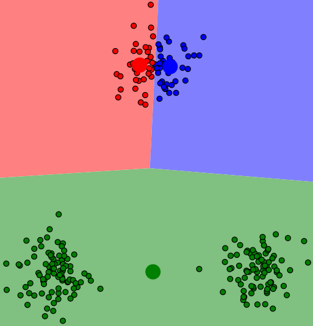
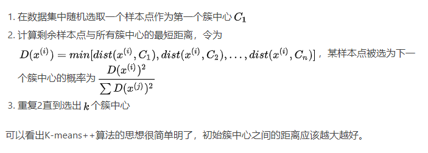
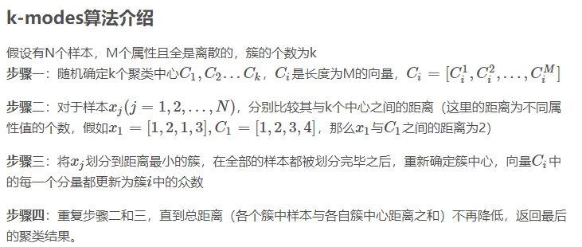

# KMeans and related algorithms
## 1. KMeans
### 1.1. [基本原理](https://www.jianshu.com/p/e4d5a0fbcefe)
算法流程：

由于初始簇中心选择，可能导致局部最优解：

解决方案：
1. KMeans++:

2. 重复运行几十次上百次，每次重复时选择不同的初始值

K值确定：
肘部法则：随着值的增大，平均畸变程度会减小；每个类包含的样本数会减少，于是样本离其重心会更近。但是，随着值继续增大，平均畸变程度的改善效果会不断减低。值增大过程中，畸变程度的改善效果下降幅度最大的位置对应的值就是肘部。**（类似经济学中marginal profit）**
```python
ks = range(1, 6)
inertias = []

for k in ks:
    # Create a KMeans instance with k clusters: model
    model = KMeans(n_clusters=k)
    
    # Fit model to samples
    model.fit(samples)
    
    # Append the inertia to the list of inertias
    inertias.append(model.inertia_)
    
# Plot ks vs inertias
plt.plot(ks, inertias, '-o')
plt.xlabel('number of clusters, k')
plt.ylabel('inertia')
plt.xticks(ks)
plt.show()
```
其他指标：轮廓系数


### 1.2. 优缺点
#### 1.2.1. 优点
1. 容易理解
2. 处理大数据时能保持较好的伸缩性和高效性
3. 当簇靠近高斯分布时效果很好
#### 1.2.2. 缺点
1. K值需要自己确定
2. 对初始位置设定敏感
3. 不适合发现非凸形状的簇或者大小差别较大的簇
4. 离群点对模型影响较大

### 1.2.3. 重要参数
1. n_clusters，默认8
2. max_iter，执行一次k-means的最大迭代数，默认300
3. n_init，用不同质心初始值运行的次数，在inertia指标下选出最优结果，默认10
4. init，三个可选值：'k-means++', 'random'或者一个ndarray向量，默认为'kmeans++'

### 1.3. 预处理与适用场景
1. 标准化，使所有数据方差变为1
2. 处理离群点
[有趣的案例](https://blog.csdn.net/yunqiinsight/article/details/80134331)


## 2. K-modes聚类算法
### 2.1. [基本原理](https://blog.csdn.net/tyh70537/article/details/78158674)
适用于离散属性的数据集：


