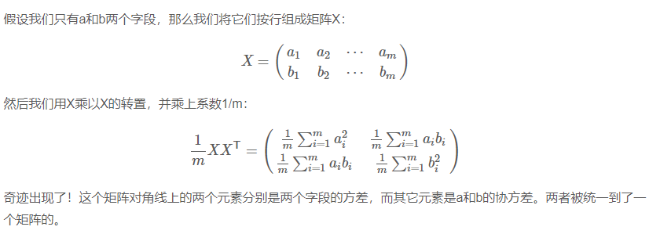

# PCA and related algorithms
## 1. PCA
### 1.1. [基本原理](https://blog.csdn.net/program_developer/article/details/80632779)
将n维特征映射到k维上，这k维是全新的正交特征也被称为主成分，是在原有n维特征的基础上重新构造出来的k维特征。<br>

思考：我们如何得到这些包含最大差异性的主成分方向呢？

答案：事实上，通过计算数据矩阵的协方差矩阵，然后得到协方差矩阵的特征值特征向量，选择特征值最大(即方差最大)的k个特征所对应的特征向量组成的矩阵。这样就可以将数据矩阵转换到新的空间当中，实现数据特征的降维。<br>
<br>
[数学原理](http://blog.codinglabs.org/articles/pca-tutorial.html)
<br>
pi * aj : 向量aj在pi上的投影
两个矩阵相乘的意义是将右边矩阵中的每一列列向量变换到左边矩阵中每一行行向量为基所表示的空间中去。
我们希望变换之后的数据在每一维上方差尽量大，不同维间协方差尽量小（不表示重复信息），而协方差的计算方式为内积除以元素数目，故我们希望不同基正交，从而使协方差为零。<br>
协方差矩阵：<br>
<br>
优化目的等价于协方差举证的对角化：<br>
<br>

选择K值：intrinsic dimensions:
```python
# Create a PCA instance: model
pca = PCA()

# Fit model to points
pca.fit(grains)

features = range(pca.n_components_)
plt.bar(features, pca.explained_variance_)
```

### 1.2. 优缺点
#### 1.2.1. 优点
1. 可以很好的处理线性相关
2. 降维效果好，去除噪声
#### 1.2.2. 缺点
1. 无法处理高阶相关性（考虑Kernel PCA）
2. 无法处理非正交方向上方差较大
3. 无参数

## 2. Kernel PCA
#### 2.1. 基本原理
KPCA的大致思路是：对于输入空间(Input space)中的矩阵X ，我们先用一个非线性映射把X中的所有样本映射到一个高维甚至是无穷维的空间(称为特征空间，Feature space)，(使其线性可分)，然后在这个高维空间进行PCA降维。