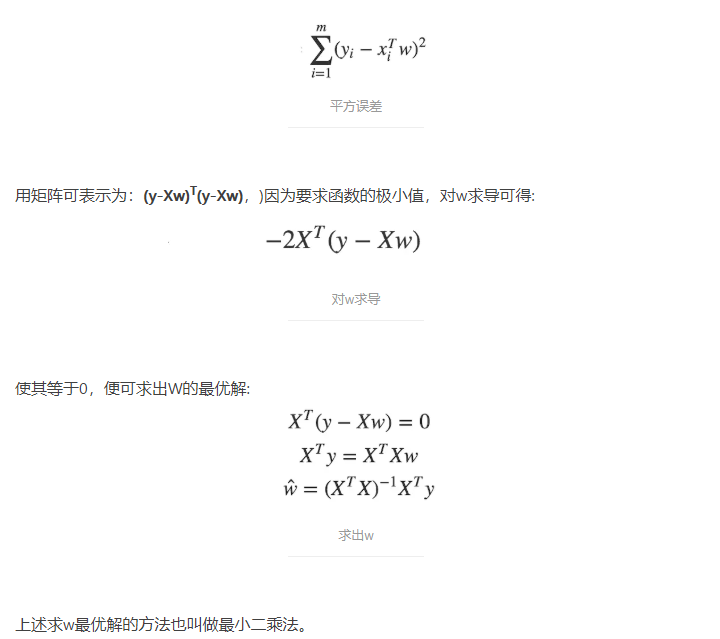
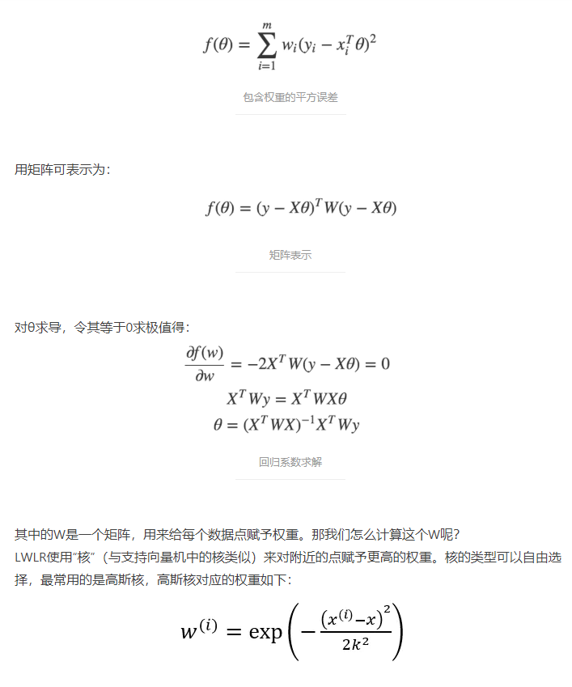
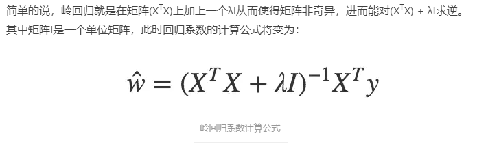
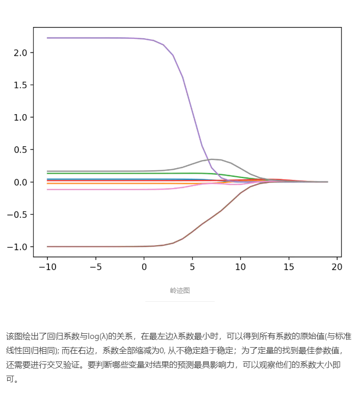

# Some regression algorithms
## 1. Linear model
### 1.1. 基本原理
普通线性回归，通过最小二乘法计算最小均方差的无偏差估计： 
 
**注意：这里的矩阵必须是可逆的**
可以通过correlation的计算判断模型好坏（真实值与预测值相关性）

### 1.2. 缺点
可能会欠拟合，解决方案：欠拟合是由于计算所有点的时候都是无偏差的计算误差，希望对不同点能够对误差进行调整

## 2. 局部加权线性回归
### 2.1. 基本原理
给在预测点附近的每一个点赋予一定权重，越靠近预测点的数据点分配的权重越高： 
 
通过公式可以看到如果xi距离x的距离越小，W(i)就会越大，其中参数k决定了权重的大小。k越大权重的差距就越小，k越小权重的差距就很大，仅有局部的点参与进回归系数的求取，其他距离较远的权重都趋近于零。如果k去进入无穷大，所有的权重都趋近于1，W也就近似等于单位矩阵，局部加权线性回归变成标准的无偏差线性回归，会造成欠拟合的现象；当k很小的时候，距离较远的样本点无法参与回归参数的求取，会造成过拟合的现象。
[原文](https://www.jianshu.com/p/bc31a3f74670)

### 2.2. 缺点
对于每一个要预测的点，都要重新依据整个数据集计算一个线性回归模型出来，增加了很大的计算量，使得算法代价极高。解决方案：除了预测点附近，大多数数据点的权重都接近于零，如果避免这些计算将可以减少程序运行时间，从而缓解因计算量增加所带来的问题。

## 3. 岭回归
### 3.1. 基本原理
 
很明显，我们要找到使预测误差最小的λ，不同的λ可以得到不同的参数w，因此我们可以改变λ的值来得到岭回归系数的变化，通过岭迹图我们可以观察较佳的λ取值：
 

### 3.2. 缺点
L2范数惩罚项的加入使得满秩，保证了可逆，但是也由于惩罚项的加入，使得回归系数β的估计不再是无偏估计。所以岭回归是以放弃无偏性、降低精度为代价解决病态矩阵问题的回归方法。
