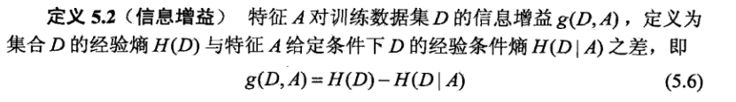

# Notes about regular-used algorithm
## 1. Decision Tree
### 1.1. 基本原理

核心思想：逐层减少信息的不确定性，衡量手段：信息熵

怎样构建才能使信息熵下降最快？比较信息增益：

具体计算方法：

为避免倾向于分支较多的特征，比较信息增益比：


### 1.2. 决策树生成算法
#### 1.2.1. ID3


缺点：
1. 偏向于具有大量值的属性（信息增益的弊端）
2. 不能处理连续分布的数据特征

#### 1.2.2. C4.5
1. 离散化思想：对于连续属性先按大小进行排序，分类发生的地方切开：如下图共7种离散化方式

2. 采用信息增益比来选择属性，但还是通过信息增益来选择离散化分界点
3. 处理缺失值：Probability Weights：


#### 1.2.3. CART
1. 二分：在每次判断过程中，都是对样本数据进行二分。即使一个feature有多个取值，也是把数据分为两部分。
2. 单变量分割：每次最优划分都是针对单个变量。
3. 剪枝：分为预剪枝和后剪枝
GINI指数：

分叉时选择最优特征的最优二分方式，对连续值处理类似C4.5
**注意：CART采用的是不停的二分。会考虑把特征A分成{A1}和{A2,A3}、{A2}和{A1,A3}、{A3}和{A1,A2}三种情况，找到基尼系数最小的组合，比如{A2}和{A1,A3}，然后建立二叉树节点，一个节点是A2对应的样本，另一个节点是{A1,A3}对应的样本。由于这次没有把特征A的取值完全分开，后面还有机会对子节点继续选择特征A划分A1和A3。这和ID3、C4.5不同，在ID3或C4.5的一颗子树中，离散特征只会参与一次节点的建立。**
预剪枝：
根据深度、节点中样本个数、不纯度下降幅度来提前停止树的生长。
后剪枝：
删除一些子树，用叶节点代替。
对于原始的CART树A0，先剪去一棵子树，生成子树A1，然后再从A1剪去一棵子树生成A2，直到最后剪到只剩一个根结点的子树An，于是得到了A0-AN一共n+1棵子树。
然后再用n+1棵子树预测独立的验证数据集，谁的误差最小就选谁，大致的思路就是这样。子树的生成方法：


### 1.3. 优缺点
#### 1.3.1. 优点
1. 可以生成可以理解的规则
2. 计算量相对不大
3. 可以处理连续和种类字段
4. 可以清晰显示哪些字段比较重要
5. 适合高维数据

#### 1.3.2. 缺点
1. 对连续型字段比较难预测
2. 对于有时间顺序数据，需要许多预处理（在投资方案比较选择时考虑时间因素，建立时间可比原则和条件的重要性。）
3. 类别较多时，错误可能增加的比较快（所以预处理时要分桶）
4. 处理特征关联性比较强的数据时，表现不太好
5. 容易过拟合

### 1.4. 适用场景
（1）具有决策者期望达到的明确目标
（2）存在决策者可以选择的两个以上的可行的备选方案
（3）存在决策者无法控制的两个以上不确定因素
（4）不同方案在不同因素下的收益或损失可以计算出来
（5）决策者可以估计不确定因素发生的概率
**注：根据决策树的缺点，必要的预处理：**
1. 连续字段离散化
2. 离散字段根据直方图分桶，控制类别数目
3. 处理好相关性强的字段

## 2. Random Forest
### 2.1. 基本原理
1. 训练决策树抽样方式：随机且有放回的抽取（避免盲人摸象）
2. 特征维度M，指定常数m小于M，随机选出m个特征训练
3. 最大程度生长，没有剪枝
4. oob error：随机森林泛化误差的无偏估计，类似K-fold
案例代码：
```Python
from sklearn.model_selection import KFold

kf = KFold(n_splits=5, random_state=2)
rfc = RandomForestClassifier()

## Search grid for optimal parameters
rf_param_grid = {'bootstrap': [True, False],
                 'criterion':['gini'],
                 'max_features': ['auto'],
                 'min_samples_leaf': [5, 7],
                 'min_samples_split': [4, 6],
                 'n_estimators': [900, 1100, 1300],
                 'n_jobs': [-1, 2, 5],
                 'oob_score':[False, True],
                 'verbose': [0, 1]}


gs_rfc = GridSearchCV(rfc, param_grid = rf_param_grid, cv=kf, scoring="accuracy", n_jobs= 4, verbose = 1)

gs_rfc.fit(X_train,y_train)

# Print out best hyperparameters
gs_rfc.best_estimator_
```
### 2.2. 优缺点
#### 2.2.1. 优点
1. 极好的准确率
2. 有效处理大数据集
3. 处理高维数据
4. 评估各个特征的重要性
5. 能够获取内部生成误差的无偏估计
6. 处理缺失值
7. 抗过拟合能力
#### 2.2.2. 缺点
1. 计算成本高，训练时间长

## 3. Adaboost
### 3.1. 基本原理
Adaboost算法基本原理就是将多个弱分类器（弱分类器一般选用单层决策树）进行合理的结合，使其成为一个强分类器。

Adaboost采用迭代的思想，每次迭代只训练一个弱分类器，训练好的弱分类器将参与下一次迭代的使用。也就是说，在第N次迭代中，一共就有N个弱分类器，其中N-1个是以前训练好的，其各种参数都不再改变，本次训练第N个分类器。其中弱分类器的关系是第N个弱分类器更可能分对前N-1个弱分类器没分对的数据，最终分类输出要看这N个分类器的综合效果。
————————————————
[原文链接](https://blog.csdn.net/px_528/article/details/72963977)


单层决策树：
一共只有一个决策点，所以只能在其中一个维度中选择一个合适的决策阈值作为决策点。

两种权重：
数据的权重主要用于弱分类器寻找其分类误差最小的决策点，找到之后用这个最小误差计算出该弱分类器的权重（发言权），分类器权重越大说明该弱分类器在最终决策时拥有更大的发言权。单层决策树计算误差时，Adaboost要求其乘上权重，即计算带权重的误差。
在Adaboost算法中，每训练完一个弱分类器都就会调整权重，上一轮训练中被误分类的点的权重会增加，在本轮训练中，由于权重影响，本轮的弱分类器将更有可能把上一轮的误分类点分对，如果还是没有分对，那么分错的点的权重将继续增加，下一个弱分类器将更加关注这个点，尽量将其分对。

第i轮迭代要做这么几件事：

1. 新增弱分类器WeakClassifier(i)与弱分类器权重alpha(i)
2. 通过数据集data与数据权重W(i)训练弱分类器WeakClassifier(i)，并得出其分类错误率，以此计算出其弱分类器权重alpha(i)
3. 通过加权投票表决的方法，让所有弱分类器进行加权投票表决的方法得到最终预测输出，计算最终分类错误率，如果最终错误率低于设定阈值（比如5%），那么迭代结束；如果最终错误率高于设定阈值，那么更新数据权重得到W(i+1)
[数学原理](https://www.cnblogs.com/ScorpioLu/p/8295990.html)

### 3.2. 优缺点
#### 3.2.1. 优点
1. 可以集成不同的弱分类器
2. 高精度
3. 相对于Random Forest，考虑了每个分类器的权重
#### 3.2.2. 缺点
1. 迭代次数不太好设定，建议使用交叉验证
2. 数据不平衡导致分类精度下降
3. 耗时

### 3.3. 适用场景
模式识别，计算机视觉，二分类多分类

## 4. Gradient Tree Boosting
### 4.1. [基本原理](https://blog.csdn.net/qq_39521554/article/details/80714945)
1. 回归树

CART回归树生成算法：

2. 提升树
GBDT 直观理解：每一轮预测和实际值有残差，下一轮根据残差再进行预测，最后将所有预测相加，就是结果。


运算逻辑如下：


### 4.2. 优缺点
#### 4.2.1. 优点
1. 精度高
2. 适合低维数据
3. 能处理非线性数据
4. 使用一些健壮的损失函数，对异常值的鲁棒性非常强。比如 Huber损失函数和Quantile损失函数。
#### 4.2.2. 缺点
1. 维度高时复杂度大

### 4.3. 主要参数
1. n_estimator
2. learning_rate, 用于控制每棵树对前一棵树的错误的纠正强度。(与n_estimator高度相关)
3. max_depth（max_leaf_nodes）用于降低每棵树的复杂度
