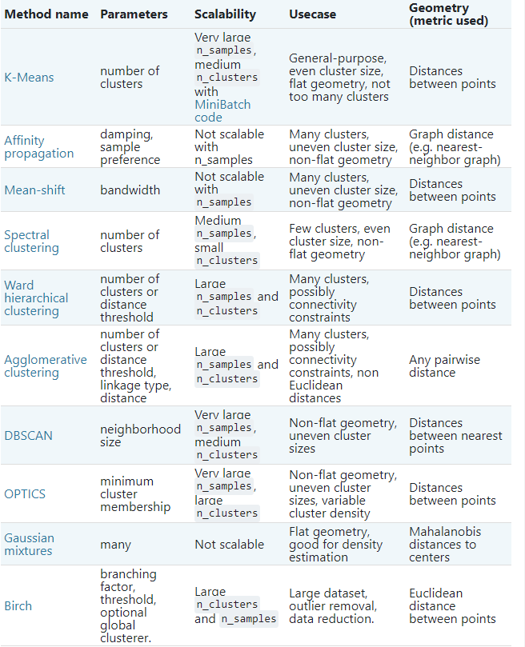
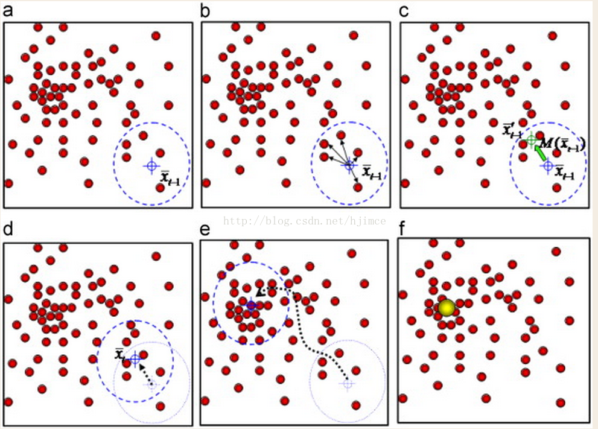
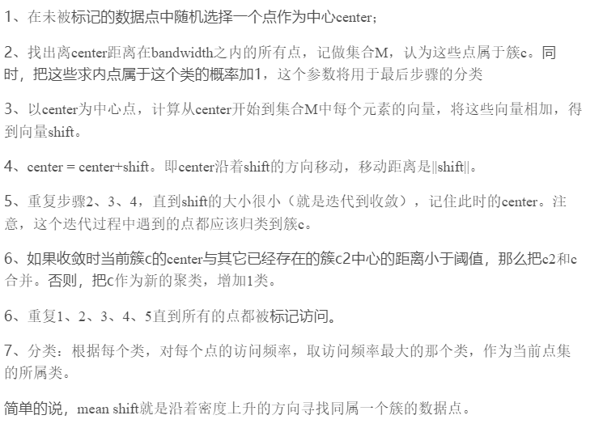
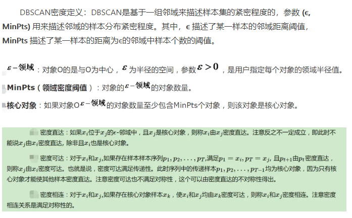
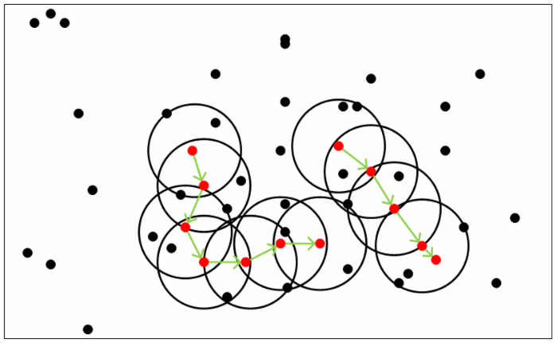

# Some other clustering algorithms and their comparison
## 1. Overview
 

## 2. Mean Shift
### 2.1. 基本原理
每次迭代的时候，都是找到圆里面点的平均位置作为新的圆心位置。
 
 

### 2.2. 优缺点
#### 2.2.1 优点
1. 计算量小
2. 无需预先估计集群形状
3. 善于处理离群点
#### 2.2.2 缺点
1. 需要调试窗口大小
2. 不善于处理高纬数据
3. 比KMeans计算量大

## 3. DBSCAN
### 3.1. [基本原理](https://www.jianshu.com/p/d2eddc733c4d)
 
 
1. 簇的发现过程
初始，给定数据集D中所有对象都被标记为“unvisited”，DBSCAN随机选择一个未访问的对象p，标记p为“visited”，并检查p的ϵ-领域是否至少包含MinPts个对象。如果不是，则p被标记为噪声点。否则为p创建一个新的簇C，并且把p的ϵ-领域中所有对象都放在候选集合N中。DBSCAN迭代地把N中不属于其他簇的对象添加到C中。在此过程中，对应N中标记为“unvisited”的对象 P' ,DBSCAN把它标记为“visited”，并且检查它的ϵ-领域，如果 P' 的ϵ-领域至少包含MinPts个对象，则P' 的ϵ-领域中的对象都被添加到N中。DBSCAN继续添加对象到C，直到C不能扩展，即直到N为空。此时簇C完成生成，输出。 
为了找到下一个簇，DBSCAN从剩下的对象中随机选择一个未访问过的对象。聚类过程继续，直到所有对象都被访问。 
距离计算可以采用欧氏距离或者KD树、球树

### 3.2. 优缺点
#### 3.2.1. 优点
1. 善于处理噪音
2. 
#### 3.2.2. 缺点
1. 不完全稳定（先来后到）
2. 密度不均匀、聚类间距相差大时表现不好
3. 不适合高维度